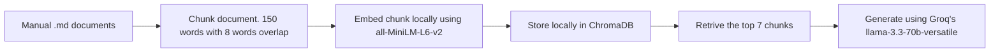

# Project 1 Planning: The Unofficial Guide

> Write this document before you write any pipeline code.
> Your spec and architecture diagram are what you'll use to direct AI tools (Claude, Copilot, etc.) to generate your implementation — the more specific they are, the more useful the generated code will be.
> Update the Retrieval Approach and Chunking Strategy sections if you change your approach during implementation.
> Update this file before starting any stretch features.

---

## Domain

<!-- What domain did you choose? Why is this knowledge valuable and hard to find through official channels? -->
Student life, events and activites for GMU students and around the DMV area. This is particularly hard for student, especially incoming freshman, since GMU is mainly commuter school. If you commute to campus, you often don't get to spend as much time around people that know the place for parties, underground venue, or other fun (ideally low cost) entertainment activies around the DMV area.

---

## Documents

<!-- List your specific sources: URLs, subreddit names, forum threads, or file descriptions.
     Aim for at least 10 sources that together cover different subtopics or perspectives within your domain. -->

| # | Source | Description | URL or location |
|---|--------|-------------|-----------------|
| 1 | r/gmu | Anyone have any tips for incoming GMU freshman? | https://www.reddit.com/r/gmu/comments/1k9mks/anyone_have_any_tips_for_incoming_gmu_freshman/|
| 2 | r/gmu | Looking at going to gmu, what is there to do for fun around gmu?  | https://www.reddit.com/r/gmu/comments/tdc7tz/looking_at_going_to_gmu_what_is_there_to_do_for/ |
| 3 | Bond's Escape Room | Things to do near GMU Guide | https://bondsescaperoom.com/epic-things-to-do-near-gmu-student-guide |
| 4 | GMU | Patriot Perk things to do | https://patriotperks.gmu.edu/things-to-do/ |
| 5 | GMU | Patriot Perk food and drinks | https://patriotperks.gmu.edu/food-drink/ |
| 6 | Blog | My 11 Favorite Things to Do in Fairfax, VA (From a Local) | https://virginiavacationguide.com/things-to-do-in-fairfax-va/ |
| 7 | DC's Website | Music Venues in DC | https://washington.org/visit-dc/live-music-venues-washington-dc |
| 8 | DC's Website | DC Bucket List | https://washington.org/visit-dc/bucket-list |
| 9 | DC's Website | DC Bucket List 2 | https://washington.org/visit-dc/your-washington-dc-summer-bucket-list |
| 10 | Blog | Things to do in Alexandria VA | https://www.funinfairfaxva.com/things-to-do-in-alexandria-va/ |

---

## Chunking Strategy

<!-- How will you split documents into chunks?
     State your chunk size (in tokens or characters), overlap size, and explain why those
     numbers fit the structure of your documents.
     A review-heavy corpus warrants different chunking than a long FAQ. -->

Each chunk would have metadata.
- Links to the original post
- Name of the source
- Description/title of the post

**Chunk size:**

Recursive chunking with a size of 150 words.
Min words count of 8 words

**Overlap:**

8 words overlap

**Reasoning:**

Most of the document will be guide and reviews. Some guide are long but some are short. I found that ~150 woords chunk capture each document nicely.

---

## Retrieval Approach

<!-- Which embedding model are you using (e.g., all-MiniLM-L6-v2 via sentence-transformers)?
     How many chunks will you retrieve per query (top-k)?
     If you were deploying this for real users and cost wasn't a constraint, what tradeoffs
     would you weigh in choosing a different embedding model — context length, multilingual
     support, accuracy on domain-specific text, latency? -->

I would use a pure sementic search model.

**Embedding model:**
all-MiniLM-L6-v2 via sentence-transformers

**Top-k:**
7-chunks

**Production tradeoff reflection:**
Lower chunk reduce token cost but might give the LLM too little context. Since the chunks are quite small and user might ask broad questions, I put the top-k = 7 so that the LLM can have more context at the expense of token cost.
I went with pure sementic search currently since it is the simplest solution, but a hybrid search with a keyword index using BM25 would be better.

---

## Evaluation Plan

<!-- List your 5 test questions with their expected correct answers.
     Questions should be specific enough that you can judge whether the system's response
     is right or wrong. "What are good dining halls?" is too vague.
     "What do students say about wait times at [dining hall name] during lunch?" is testable. -->

| # | Question | Expected answer |
|---|----------|-----------------|
| 1 | | |
| 2 | | |
| 3 | | |
| 4 | | |
| 5 | What's the best professor for MATH214 | System should refuse to response since it is outside it's domain  |

---

## Anticipated Challenges

<!-- What could go wrong? Name at least two specific risks with reasoning.
     Consider: noisy or inconsistent documents, missing source attribution, off-topic
     retrieval, chunks that split key information across boundaries. -->

1. Gathering the documents are a pain in the bum. Each website are formatted differently. I am planning to manually copy and paste each website into a markdown file so that I don't have to deal with cleaning boileplate like HTML tags, navigation menus, cookie banners, ads, etc. 

2. My current plan for the chunking system is not that robust, it might split information like the locations from the reviews. 

---

## Architecture

<!-- Draw a diagram of your pipeline showing the five stages:
     Document Ingestion → Chunking → Embedding + Vector Store → Retrieval → Generation
     Label each stage with the tool or library you're using.
     You can use ASCII art, a Mermaid diagram, or embed a sketch as an image.
     You'll use this diagram as context when prompting AI tools to implement each stage. -->

---

## AI Tool Plan

<!-- For each part of the pipeline below, describe:
     - Which AI tool you plan to use (Claude, Copilot, ChatGPT, etc.)
     - What you'll give it as input (which sections of this planning.md, which requirements)
     - What you expect it to produce
     - How you'll verify the output matches your spec

     "I'll use AI to help me code" is not a plan.
     "I'll give Claude my Chunking Strategy section and ask it to implement chunk_text()
     with my specified chunk size and overlap" is a plan. -->

I am plannign to use Claude as myy AI peer coder. I plan to give it this planning document and have it poke holes into my plan so that I can see where in the plan I need to improve.

**Milestone 3 — Ingestion and chunking:**

**Milestone 4 — Embedding and retrieval:**

**Milestone 5 — Generation and interface:**
